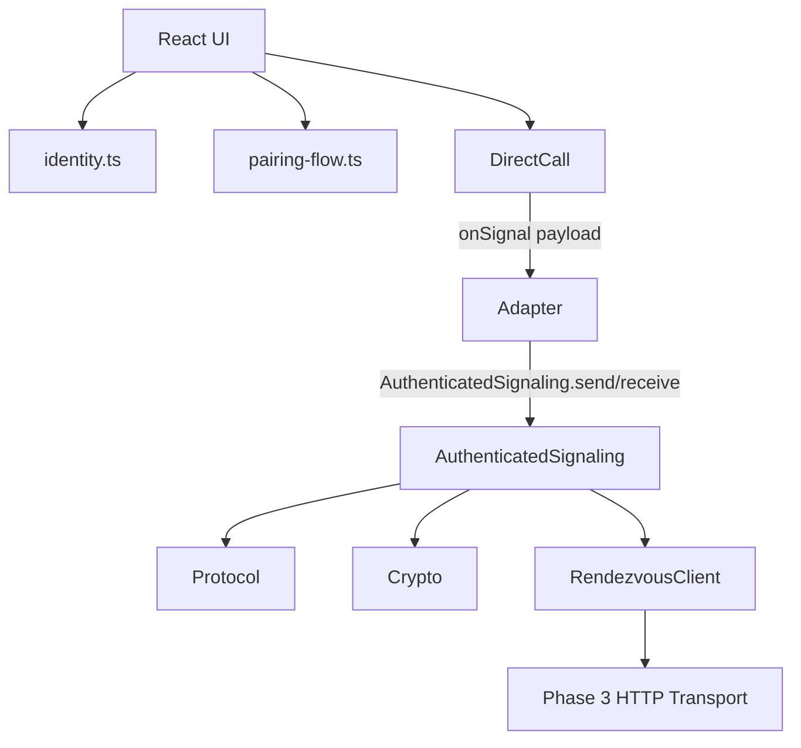

# SecureVoice Architecture

This document tracks the dependency graph and architectural boundaries of SecureVoice.

## Dependency Diagram

### Key Principles

1. **Decoupled Transport:** The WebRTC controller (`DirectCall`) only communicates via the `onSignal` callback. It does not import the `AuthenticatedSignaling` bridge or any network code.
2. **Security Boundaries:** Invalid or malicious signaling messages are intercepted and dropped by `AuthenticatedSignaling` before they ever reach the WebRTC controller.
3. **Privacy First:** Peer connections and media access are strictly gated behind user acceptance. Incoming offers are verified but do not trigger WebRTC initialization until the UI explicitly approves.
4. **No Server Identity:** The rendezvous server is a dumb transport for opaque ciphertexts. It cannot read contacts, identities, ICE candidates, or SDPs.
